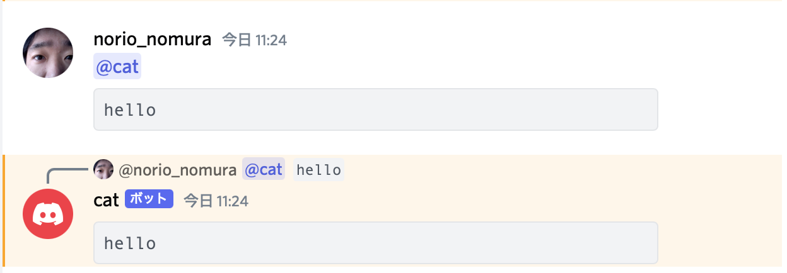

# CLI Discord Bot 2

CLI Discord Bot 2 is a Discord bot written in [Go](https://go.dev) and designed to execute arbitrary CLI commands in response to Discord messages.  
It is a re-written, modernized version of [cli_discord_bot](https://github.com/norio-nomura/cli_discord_bot), with improved modularity, testability, configuration, **and significantly lower memory usage**.

> **Note:** The original cli_discord_bot consumed much more memory mainly because it embedded a V8 JavaScript runtime. CLI Discord Bot 2 eliminates this dependency, resulting in a much smaller memory footprint.


## Getting Started

### 1. Set Up a Discord Bot Account

Follow the official guide to [create a Discord bot and get a token](https://github.com/reactiflux/discord-irc/wiki/Creating-a-discord-bot-&-getting-a-token).

**Required Permissions:**

- `CHANGE_NICKNAME` — to update the bot's nickname
- `READ_MESSAGE_HISTORY` and `VIEW_CHANNEL` — to update replies when users edit/delete messages

### 2. Invite the Bot to Your Server

Replace `<Client ID>` with your bot's Client ID and open the following URL:

```
https://discord.com/api/oauth2/authorize?client_id=<Client ID>&scope=bot&permissions=67174400
```

### 3. Run the Bot Locally with Docker Compose

```sh
export DISCORD_TOKEN="<discord token here>" # Discord bot token
docker compose up
```

### 4. Interact with the Bot

- Mention the bot in a message. The first code block in your message will be used as standard input.
- Lines mentioning the bot will be treated as CLI command arguments.
- The bot will execute the CLI for each command line and reply with the results.
- If you edit or delete your mention, the bot will also edit or delete its replies.
- In DMs, the bot will reply without requiring a mention.




## Configuration


### Build-Time Configuration

| Variable Name   | Description                                     | Default            |
| --------------- | ----------------------------------------------- | ------------------ |
| `BUILDER_IMAGE` | Docker image that provides Go compiler          | `golang:1.23`      |
| `DOCKER_IMAGE`  | Docker image that provides target CLI on Ubuntu | `ubuntu`           |


### Environment Variables (Run-Time Configuration)

| Variable Name              | Description                         | Default            |
| -------------------------- | ----------------------------------- | ------------------ |
| `DISCORD_TOKEN`            | Discord bot token                   | *(required)*       |
| `DISCORD_NICKNAME`         | Discord nickname                    | `TARGET_CLI` value |
| `DISCORD_PLAYING`          | Status for "Playing"                | `TARGET_CLI` value |
| `ENV_COMMAND`              | Env command launching target CLI    | `/usr/bin/env -i`  |
| `TARGET_CLI`               | Target CLI                          | `cat`              |
| `TARGET_ARGS_TO_USE_STDIN` | Arguments for CLI with input        |                    |
| `TARGET_DEFAULT_ARGS`      | Arguments for CLI with no arguments |                    |
| `TIMEOUT_SECONDS`          | Timeout (seconds) for CLI command   | `30`               |


#### Notable Changes from cli_discord_bot

- **Much lower memory usage**: The original version used a V8 JavaScript runtime, which consumed significant memory. This version is Go-native and streaming-oriented, so memory usage is much lower.
- `ENV_COMMAND_ARGS` is removed; `ENV_COMMAND` now allows arguments directly.
- `TIMEOUT_COMMAND` and `TIMEOUT_ARGS` are removed; use `TIMEOUT_SECONDS` instead.


### Example: Swift Compiler Bot

```sh
export DISCORD_TOKEN="<discord token here>" # Discord bot token
export DOCKER_IMAGE=swift:latest            # Docker image
export TARGET_CLI=swift                     # Target CLI
export TARGET_ARGS_TO_USE_STDIN=-           # Swift requires "-" to use stdin as code
docker compose up
```


## Author

Norio Nomura

## License

CLI Discord Bot 2 is available under the MIT license. See the [LICENSE](LICENSE) file for more information.
